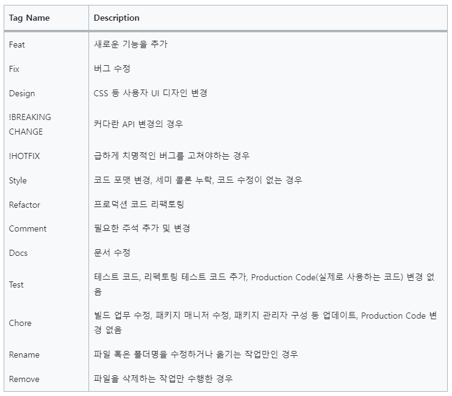

이건 나중에 다 지우고 다시 작성할 예정..!! 코드 작성할때 참고해주세요
## 기본 파일 설명
### 1. const
- http-status.const.js : http status를 저장
- messages.const.js : http response로 보낼 메시지를 저장

ex)
```
return res.status(HTTP_STATUS.CONFLICT).json({ status: HTTP_STATUS.CONFLICT, message: MESSAGES.AUTH.SIGN_UP.ISEXIST });
```

- roel.const.js : user의 role을 저장 (FAN, IVE, MONSTAX ...)
    - 역할인가 미들웨어에서 편하게 쓰라고 만들었음..

### 2. middlewares
인증/인가, 에러처리 등 미들웨어는 모두 여기 저장
- joi : joi로 유효성 검증하는 파일은 여기 모두 저장

### 3. routers
파일은 이미 만들어놨음
회원가입은 auth에서, 게시물 생성은 posts에서 만들기 시작하면 됨
API 명세서 보고 알아서 만들기..

## commit 시 규칙
아래 규칙을 따라주세요..!!
사실 저도 한번도 안지켜봄...


## 기타
- prisma는 일부러 설치 안했어요. 한솔님께서 schema 만드실때 설치 하실거같아서..
- 한솔님 prisma 셋팅하실때 .env에 db 주소 넣어주세요
- gitignore은 안건드려도 됨!!
- node modules 일단 생각나는것만 깔아놨고요, 기능 구현하실때 필요한거 있으면 추가로 설치하시면 돼요. 빠진거 많을거에요...

