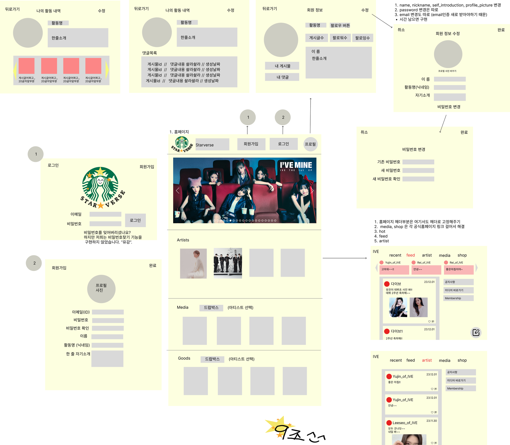

# 아티스트&팬 소통 커뮤니티 Starverse

## 🍉 프로젝트 소개
### 프로젝트명
#### ⭐스타버스(starverse)
연예인기획사 스타쉽 소속 아이돌 팬들이 모여 함께 소통하고 교류하는 우주 같은 커뮤니티

### 프로젝트 목표
위버스라는 팬 커뮤니티를 모티브하여 스타쉽 엔터테인먼트 소속 아이돌 그룹의 팬 커뮤니티를 제작하여, 원하는 유형의 게시물을 한 눈에 볼 수 있고, 팬들과 아티스트들 끼리 즐겁게 소통할 수 있도록 하였습니다.

## 🍋 팀 소개
- 팀장: 진수현
- 팀원: 나지윤
- 팀원: 노시헌
- 팀원: 석한솔

## 🍏 개발환경
- OS: Window / Mac
- Code editor: Visual Studio Code
- Client-Tool : Insomnia
- Database: AWS/RDS (MySQL)
- Server: AWS/EC2

## 🥭 개발언어
- Front-End : Html, CSS, Javascript
- Back-End : Javascript
- Node.js, Express.js
- Database: MySQL
- ORM: Prisma

## 🍑 실행 방법 (개발용)
### 1. 클론 및 패키지 설치
```
git clone
yarn
```

### 환경변수 설정
.env 파일 생성 후 다음 내용 작성
```
DATABASE_URL=(AWS RDS 주소)
ACCESS_TOKEN_SECRET_KEY=(토큰 발급시 사용할 액세스 토큰 시크릿 키)
REFRESH_TOKEN_SECRET_KEY = (토큰 발급시 사용할 리프레시 토큰 시크릿 키)

AWS_S3_REGION = 'ap-northeast-2'
AWS_ACCESS_KEY_ID = (AWS S3 액세스 키)
AWS_SECRET_ACCESS_KEY = (AWS S3 시크릿 키)
AWS_BUCKET = (AWS S3 버킷 이름)

DEFAULT_PROFILE_PICTURE=(기본 프로필 사진 url)
```

### 서버 실행
```
yarn run dev
```

## 🍊 실행 방법(서버)
3.35.238.172:3000/api 로 접속 후, api 명세서를 참고하여 api 호출

## 🍍 와이어프레임


## 🍎 API 명세서

https://teamsparta.notion.site/STAR-VERSE-caf405f4c13540d6879718f8afe3716a

## 🍌 ERD


## 🍒 프로젝트 구조
```
PP3RESUME-HUB
├── assets
│   ├── css ── index.css
│   ├── img
│   ├── js  ── index.js
│   └── index.html
├── prisma
│   └── schema.prisma
├── src
│   ├── constants
|   |   ├── http-status.constant.js
|   |   ├── message.constant.js
|   |   └── role.constant.js
│   ├── middlewares
|   │   ├── joi
|   |   |   ├── admin.joi.middleware.js
|   |   |   ├── auth.joi.middleware.js
|   |   |   ├── group.joi.middleware.js
|   |   |   └── users.joi.middleware.js
|   |   ├── access-token.middewware.js
|   |   ├── error-handler.middleware.js
|   |   ├── refresh-token.middleware.js
|   |   └── roles.middleware.js
│   ├── routers
│   │   ├── auth.router.js
│   │   ├── admin.router.js
│   │   ├── comments.router.js
│   │   ├── groups.router.js
│   │   ├── index.router.js
│   │   ├── posts.router.js
│   │   └── users.router.js
│   ├── utils/prisma
|   |   └── index.js
│   └── app.js
├── .env
├── .gitignore
├── .prettierrc.json
├── package.json
├── README.md
└── yarn.lock
```
